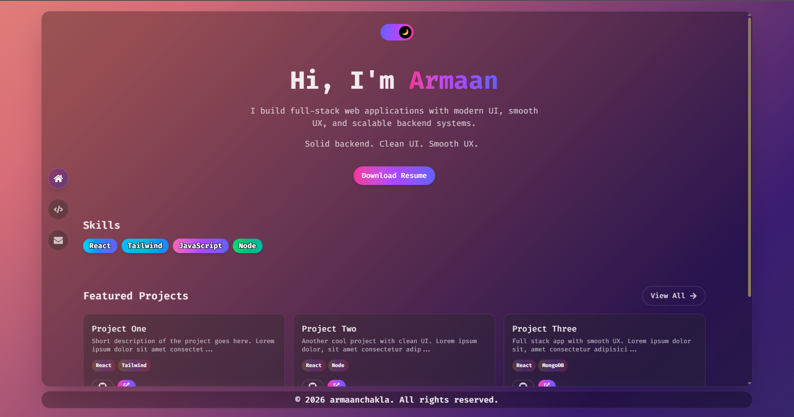

<h1 align="left">Armaan Portfolio Website 🚀</h1>

<p align="left">
A modern, responsive personal portfolio built with <b>React</b>, <b>Tailwind CSS</b>, and <b>Framer Motion</b>. It features smooth animations, a glassmorphism UI, theme switching, and a contact form with toast notifications.
</p>

<p align="center">
<a href="https://armaanchakla.vercel.app/">🌐 Live Demo</a>
</p>

## 📸 Preview

<p align="center">
  
</p>

## ✨ Features

- ⚡ Built with React + Vite
- 🎨 Styled using Tailwind CSS
- 🌗 Dark / Light theme toggle
- 🧊 Glassmorphism UI design
- 🎬 Smooth page animations (Framer Motion)
- 🧭 Custom scroll-to-top behavior
- 📩 Contact form with toast notifications
- 📱 Fully responsive (mobile friendly)
- 🔥 Modern animated background

## 🛠️ Tech Stack

- React.js
- Vite
- Tailwind CSS
- Framer Motion
- React Router DOM
- React Hot Toast

## 📁 Project Structure
```bash
src/
 ├── components/   # UI Components
 ├── configs/      # Configurations
 ├── pages/        # App Pages
 ├── utils/        # Custom utils
 ├── App.jsx
 ├── index.css
 ├── main.jsx

```

## ⚙️ Installation

Follow these steps to run the project locally:

#### Clone the repository
```bash
git clone https://github.com/armaanchakla/portfolio.git
```

#### Move into the project directory
```bash
cd portfolio
```

#### Install dependencies
```bash
npm install
```

#### Run Development Server
```bash
npm run dev
```

#### Open your browser and visit:
```bash
http://localhost:5173
```

## 📦 Build for Production
```bash
npm run build
```

## 🔍 Preview Production Build
```bash
npm run preview
```

## 🧩 Key Components

- Navbar → Left navigation + theme toggle
- SideMenu → Animated floating navigation
- Info → Personal info section
- Form → Contact form with toast feedback
- Pages → Home, Projects, Contact

## 🌟 Future Improvements
- 🔗 Backend integration for contact form (Node.js / Express)
- 📊 Project filtering with animations
- 🌍 i18n (multi-language support)
- 🚀 SEO + Lighthouse performance optimization
- 🖼️ Image lazy loading + WebP optimization
- ⚡ Performance tuning (code splitting, caching)

## 🙌 Acknowledgements
- Inspired by modern UI/UX trends
- Built with ❤️ using React ecosystem

## 💡 Motivation

This portfolio was built to showcase my frontend skills, UI/UX sense, and ability to build production-ready React applications with modern tooling.

## 📄 License
This project is open source and available under the MIT License.

